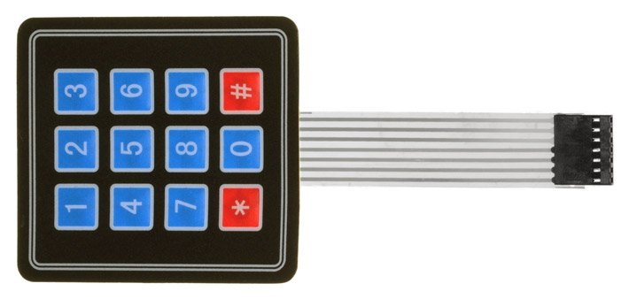
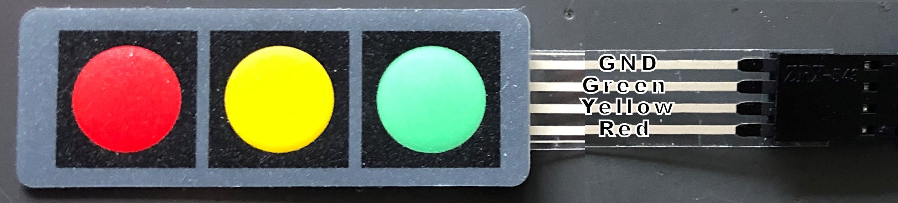
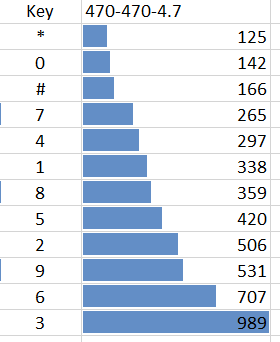
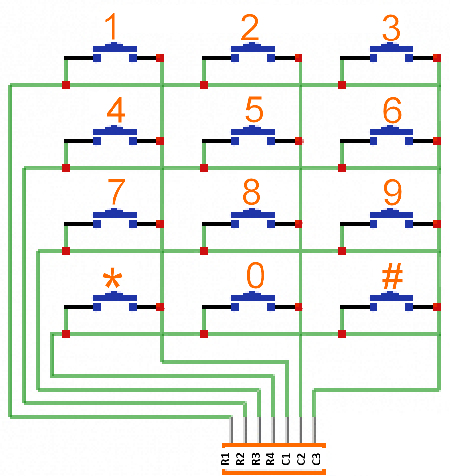
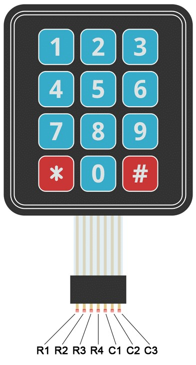
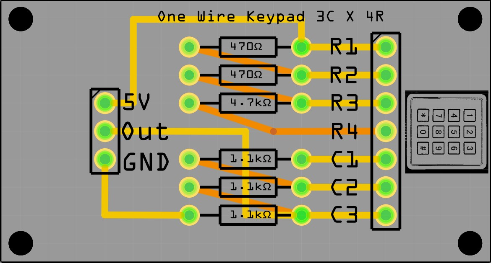
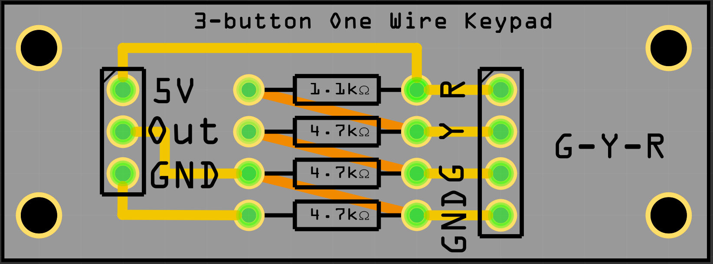
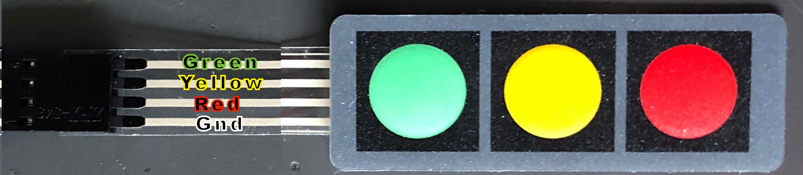
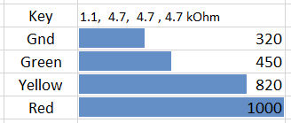

# 1x3 and 4x3 membrane keypad controlled with one wire to the analog pin

Quick and dirty copied from my web site:
https://ednieuw.home.xs4all.nl/Woordklok/OneWireKeyPad/OneWireKeyPad.html

<table style="width: 900px">
	<tr>
		<td>This page describes how to wire the output pins of a: 
		 
		- seven 
pins, 3 columns * 4 rows key pad  
		 
		 
		and a  
		</td>
		<td></td>
	</tr>
	<tr>
		<td>
- four pins three button 3 x 1 keypad,  
		 
		to a 
one wire analogue output. </o:p>
		</td>
		<td></td>
	</tr>
</table>
 
The addition of a few resistors converts the key pads to one wire and saves 
many digital pins at the cost one analogue pin. 
Libraries are not needed anymore and will save many memory bytes but lacking 
interrupt driven detection of operation of the key pad.  
But processors are very fast and in many programs it is possible to check the 
buttons more than 1000 times a second. 
The three button key pad is a nice, flat, replacement of a rotary encoder saving 
three digital pins, a library and 1500 bytes.

 
Three different resistor resistances are used. 
This page:
<a href="http://www.circuitbasics.com/how-to-set-up-a-keypad-on-an-arduino/">
http://www.circuitbasics.com/how-to-set-up-a-keypad-on-an-arduino/</a>
explains how the key pad works. 
 
There are many tutorials how to make a one-key wire keypad but or they use many 
resistors, make use of libraries or are hard to follow.

<table style="width: 1000px">
	<tr>
		<td class="auto-style2">In the picture on the right one can see that by 
		pressing a button a connection is made between a row and a column.  
		By choosing the right resistor combination the output will be different 
		for every button.  
		5V is connected to C1 and ground after a 1.1 kilo-ohm resistor. 
		When 3 is pressed the current flows from R1 tot C3 and flows to a 1.1 
		kilo-ohm resistor resulting in a reading of 989 bits.  
		Pressing * R4 and C1 and connected resulting in a flow through all the 
		resistors and a reading of 125 bits. 
		To discriminate between the buttons the difference between the 
		difference button must be as large as possible. 
		Because resistors of identical resistance value will not have exact the 
		same resistance measured, readings between modules will vary a little. 
		In the Arduino source code the range per button is large enough to 
		overcome these differences. </td>
		<td class="auto-style2">
		</td>
		<td>&nbsp;</td>
	</tr>
	<tr>
		<td class="auto-style2" colspan="3">&nbsp;</td>
	</tr>
</table>

<o:p> 
</o:p>

<table width="1000">
	<tr>
		<td>
		</td>
		<td style="width: 887px">
		</td>
	</tr>
	<tr>
		<td class="auto-style2"> 
		Source code 
		<a href="OneWireKeyPad/OneWireKeyPad.ino">OneWireKeyPad.ino</a></td>
		<td class="auto-style2" style="width: 887px">
		<a href="OneWireKeyPad.fzz">OneWireKeyPad.fzz</a> Fritzing file 
		 
		Below the source code to read the key values</td>
	</tr>
</table>
<ul>
	<li>
	<pre>int sensorPin = A0;   // select the input pin for the potentiometer
int ledPin = 13;      // select the pin for the LED
int sensorValue = 0;  // variable to store the value coming from the sensor
byte keyvalue;

void setup() 
{
 pinMode(ledPin, OUTPUT);   // declare the ledPin as an OUTPUT:
 Serial.begin(9600); 
 Serial.println("Started. Press a key");
}

void loop() 
{
 sensorValue = analogRead(sensorPin); // read the value from the sensor:
 digitalWrite(ledPin, HIGH);          // turn the ledPin on
 switch(sensorValue)
  {
    case   0 ... 100:  keyvalue = 13; break;   // noise
    case 101 ... 132:  keyvalue = 12; break;   // * 
    case 133 ... 154:  keyvalue =  0; break;   // 0 
    case 155 ... 216:  keyvalue = 11; break;   // # 
    case 217 ... 281:  keyvalue =  7; break;   // 7 
    case 282 ... 318:  keyvalue =  4; break;   // 4 
    case 319 ... 349:  keyvalue =  1; break;   // 1 
    case 350 ... 390:  keyvalue =  8; break;   // 8 
    case 391 ... 463:  keyvalue =  5; break;   // 5 
    case 464 ... 519:  keyvalue =  2; break;   // 2 
    case 520 ... 619:  keyvalue =  9; break;   // 9 
    case 620 ... 848:  keyvalue =  6; break;   // 6 
    case 849 ... 1023: keyvalue =  3; break;   // 3
  }
 if(keyvalue&lt;13) { Serial.println(keyvalue); delay(300); }
 digitalWrite(ledPin, LOW);   // turn the ledPin off:
}</pre>
	</li>
</ul>

<o:p> 
<o:p><strong>3 X 1 key pad 
 
</strong>I use this key pad instead of a rotary encoder.
<table style="width: 900px">
	<tr>
		<td colspan="2">
		</td>
	</tr>
	<tr>
		<td>
		</td>
		<td></td>
	</tr>
	<tr>
		<td>&nbsp;</td>
		<td>&nbsp;</td>
	</tr>
	<tr>
		<td>Source code: <a href="OneWireKeyPad3x1/OneWireKeyPad3x1.ino">
		OneWireKeyPad3x1.ino</a></td>
		<td>&nbsp;</td>
	</tr>
</table>
 
</o:p>

</o:p>

<pre>                           
//--------------------------------------------
// KEYPAD check for Onewire Keypad input with 5V and 1.1, 4.7, 4.7, 4.7 kOhm resistors
//--------------------------------------------
int sensorPin = A0;   // select the input pin for the potentiometer
int ledPin = 13;      // select the pin for the LED
int sensorValue = 0;  // variable to store the value coming from the sensor
char keyvalue;
char Key;
 </pre>
<pre>void setup() 
{
 pinMode(ledPin, OUTPUT);   // declare the ledPin as an OUTPUT:
 Serial.begin(9600); 
 Serial.println("Started. Press a key");
}</pre>
<pre>void loop() 
{
 sensorValue = analogRead(sensorPin); // read the value from the sensor:
 switch(sensorValue)
  {
    case   0 ... 385:  keyvalue = 99;            break;            // noise
    case 386 ... 635:  keyvalue = -1; Key = 'G'; break;            // G 
    case 636 ... 910:  keyvalue =  0; Key = 'Y'; break;            // Y 
    case 911 ... 1023: keyvalue =  1; Key = 'R'; break;            // R 
  }
 if(keyvalue&lt;2) 
   { 
    Serial.print(Key); Serial.print("  Read bits:"); Serial.println(sensorValue);
    digitalWrite(ledPin, HIGH);          // turn the ledPin on
    delay(300); 
    digitalWrite(ledPin, LOW);           // turn the ledPin off:
   }
}</pre>
<pre>
                          </pre>

<o:p>
<o:p></o:p>
 
<a href="FibonacciClockV039.zip">FibonacciClock 
software V039 + libraries for one wire 4x3 keypad</a></o:p>

<o:p>
</o:p>

<o:p>Ed Nieuwenhuys, 
	July 2022, March 2021 
November<o:p> 
        2019</o:p></o:p>

	<a href="../index.html">&lt; --
        Back to start </a>

